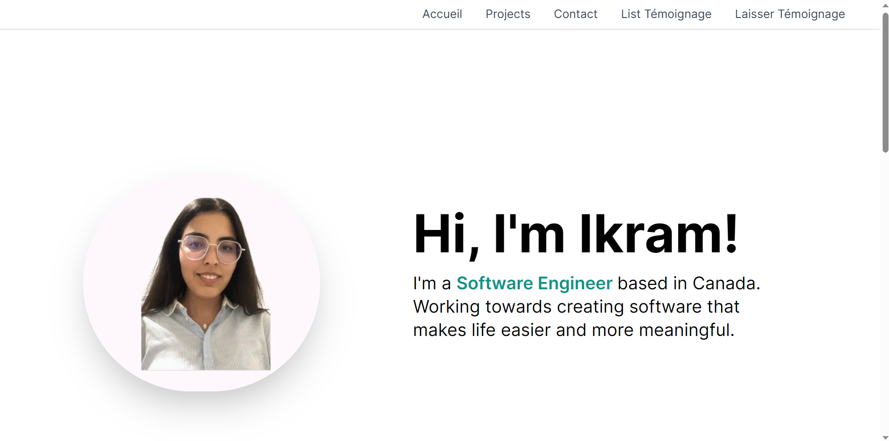
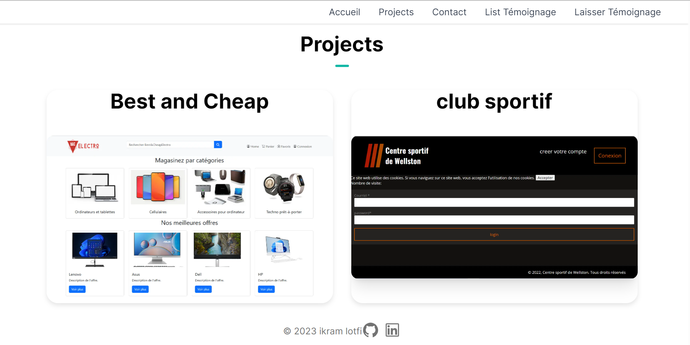
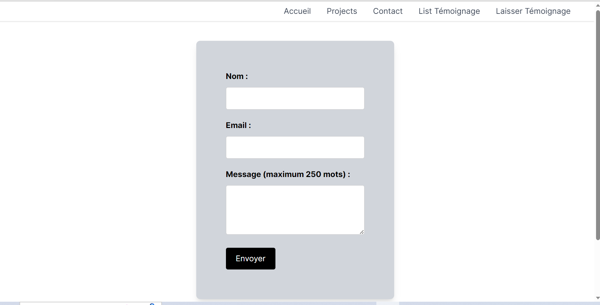
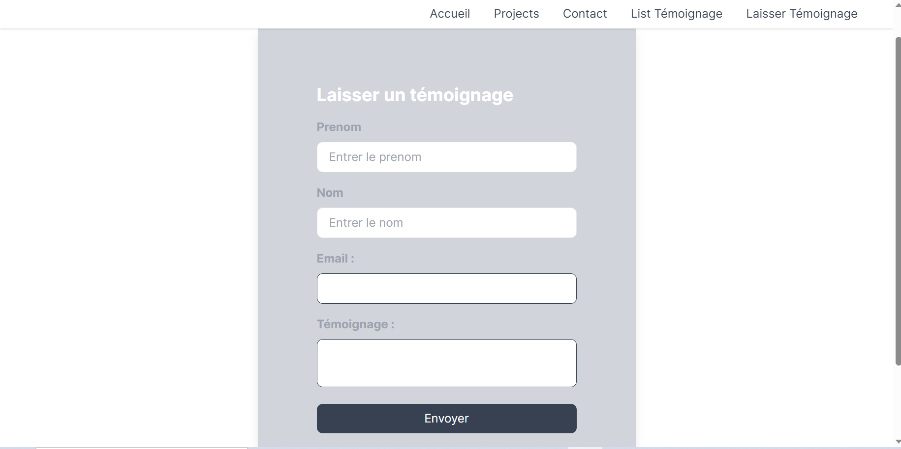

# Mon Portfolio

Ce portfolio contient mes projets personnels et professionnels. Chaque projet est accompagné d'une description détaillée et des technologies utilisées.

## Accueil

Sur la page d'accueil, vous trouverez une brève présentation de moi-même et de mes compétences en tant que développeur.

## Projets

La page des projets affiche une liste de tous mes projets. Vous pouvez cliquer sur chaque projet pour obtenir plus de détails et accéder au code source.

## Contact

Vous pouvez me contacter en remplissant le formulaire de contact sur cette page. N'hésitez pas à me poser des questions ou à discuter de nouvelles opportunités.

## Laisser Témoignage

Si vous avez travaillé avec moi auparavant, vous pouvez laisser un témoignage sur cette page pour partager votre expérience.

N'hésitez pas à explorer mon portfolio et à me contacter si vous avez des questions ou des suggestions !
